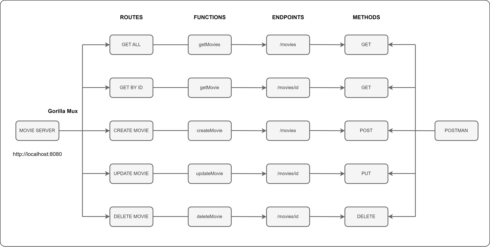

# Movie API

Movie API is a simple GoLang application that provides CRUD (Create, Read, Update, Delete) operations for managing a list of movies. It uses the Gorilla Mux router for routing HTTP requests.

## Table of Contents

- [Features](#features)
- [Prerequisites](#prerequisites)
- [Getting Started](#getting-started)
- [Flow](#flow)
- [API Endpoints](#api-endpoints)
- [Contributing](#contributing)
- [License](#license)

## Features

- Create a new movie entry with a randomly generated ID.
- Retrieve a list of all movies.
- Retrieve details of a specific movie by ID.
- Update an existing movie's details.
- Delete a movie entry by ID.

## Prerequisites

Before you begin, ensure you have met the following requirements:

- [Go](https://golang.org/doc/install): Go Programming Language installed.
- Code Editor: A code editor of your choice.
- Terminal: A terminal or command prompt for running the application.

## Getting Started

1. Clone the repository:

   ```bash
   git clone <repository-url>
   cd <repository-directory>
   ```

2. Run the application:
    ```bash
    go run main.go
    ```

The server will start at `http://localhost:8080`.

## Flow



## API Endpoints

### Get Movies
- **URL:** `/movies`
- **Method:** GET
- **Description:** Retrieve a list of all movies.

### Get Movie by ID
- **URL:** `/movies/{id}`
- **Method:** GET
- **Description:** Retrieve details of a specific movie by ID.

### Create Movie
- **URL:** `/movies`
- **Method:** POST
- **Description:** Create a new movie entry with a randomly generated ID. Provide JSON data in the request body.

### Update Movie by ID
- **URL:** `/movies/{id}`
- **Method:** PUT
- **Description:** Update an existing movie's details by ID. Provide JSON data in the request body.

### Delete Movie by ID
- **URL:** `/movies/{id}`
- **Method:** DELETE
- **Description:** Delete a movie entry by ID.

## License
This project is licensed under the MIT License - see the [LICENSE]() file for details.